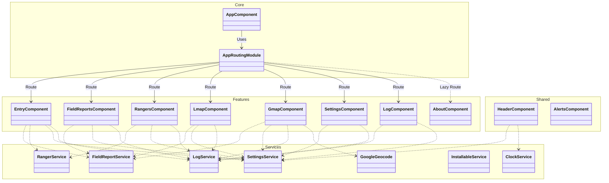

# RangerTrak Architecture

This document describes the high-level architecture of the RangerTrak application.

```mermaid
classDiagram
    direction TB

    namespace Core {
        class AppComponent
        class AppRoutingModule
    }

    namespace Features {
        class EntryComponent
        class FieldReportsComponent
        class RangersComponent
        class LmapComponent
        class GmapComponent
        class SettingsComponent
        class LogComponent
        class AboutComponent
    }

    namespace Shared {
        class HeaderComponent
        class AlertsComponent
    }

    namespace Services {
        class FieldReportService
        class RangerService
        class SettingsService
        class LogService
        class ClockService
        class InstallableService
        class GoogleGeocode
    }

    AppComponent --> AppRoutingModule : Uses
    AppRoutingModule --> EntryComponent : Route
    AppRoutingModule --> FieldReportsComponent : Route
    AppRoutingModule --> RangersComponent : Route
    AppRoutingModule --> LmapComponent : Route
    AppRoutingModule --> GmapComponent : Route
    AppRoutingModule --> SettingsComponent : Route
    AppRoutingModule --> LogComponent : Route
    AppRoutingModule ..> AboutComponent : Lazy Route

    EntryComponent ..> FieldReportService
    EntryComponent ..> RangerService
    EntryComponent ..> SettingsService
    EntryComponent ..> LogService

    FieldReportsComponent ..> FieldReportService
    FieldReportsComponent ..> SettingsService
    FieldReportsComponent ..> LogService

    RangersComponent ..> RangerService
    RangersComponent ..> SettingsService
    RangersComponent ..> LogService

    LmapComponent ..> FieldReportService
    LmapComponent ..> SettingsService
    LmapComponent ..> LogService

    GmapComponent ..> FieldReportService
    GmapComponent ..> SettingsService
    GmapComponent ..> LogService
    GmapComponent ..> GoogleGeocode

    SettingsComponent ..> SettingsService
    SettingsComponent ..> LogService

    LogComponent ..> LogService
    LogComponent ..> SettingsService

    HeaderComponent ..> SettingsService
    HeaderComponent ..> ClockService
```
