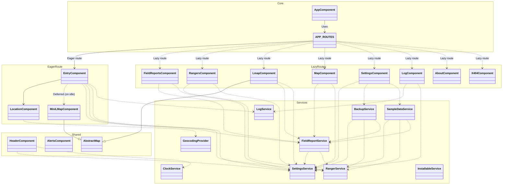

# RangerTrak Architecture

This document describes the high-level architecture of the RangerTrak application. It is
written for developers and assumes familiarity with Angular, bundling, and the codebase.

*Operators and Emergency Coordinators want [FIELD-GUIDE.md](FIELD-GUIDE.md) instead —
features, and how to prepare a device so the app works when the network doesn't.*

## Mapping engines

RangerTrak ships **two independent map engines**. This is deliberate, not a migration
half-finished: they have genuinely different offline behaviour, and which one is the right
default is still an open question for the Entry page.

| | Leaflet (`/lmap`) | MapLibre + PMTiles (`/map`) |
| --- | --- | --- |
| Full-page component | `LmapComponent` | `MapComponent` |
| Mini-map component | `MiniLMapComponent` | `MiniMapComponent` |
| Basemap source | OpenStreetMap tile servers, over the network | `src/assets/maps/vashon.pmtiles`, bundled in the app |
| Works offline | Only for areas already viewed or explicitly saved | **Yes, for the whole extract** — but see the caching caveat below |
| Coverage | Anywhere in the world | Vashon Island pilot extract only; panning outside shows background |
| Bundle cost | ~150 kB | ~950 kB (lazy chunk, loaded with `/map`) |
| Clustering | `leaflet.markercluster` | Native GeoJSON clustering |
| Offline tile caching | `leaflet.offline` — "Save this area for offline use" control | Not needed; the whole extract is bundled |

### Open decision: which engine powers the Entry page mini-map

The Entry form has **one** mini-map slot. It currently uses `MiniLMapComponent`
(Leaflet). `MiniMapComponent` (MapLibre) is built and working but not wired into
Entry's template — swapping them is a small change.

The trade-off is **offline capability, not speed**:

- The **MapLibre** mini-map works fully offline from the bundled PMTiles extract, from a
  cold start, with no network and no prior visit to that area.
- The **Leaflet** mini-map needs OSM tiles from the network. It caches what it has already
  shown (via `leaflet.offline`), so it degrades to blank tiles for any area the operator
  has not previously viewed online.

For an emergency-operations tool — where the realistic failure mode is *the network is
down and the operator is entering a report* — that argues for MapLibre on the Entry page,
which is the one screen an operator uses continuously during a mission.

Load time is **not** a reason to prefer either one. MapLibre is roughly six times larger
than Leaflet, so switching would make the page heavier, not lighter — but since the
mini-map is wrapped in `@defer (on idle)` (see `entry.component.html`), neither engine is
in the initial download, and neither blocks the form from painting.

The cost of switching is coverage: the bundled extract is Vashon Island only, so an
operator working outside that region would get a background-only map where Leaflet would
have shown real streets given a network. Widening coverage is tracked as the planned
low-res world background plus a region-download manager.

**Not yet decided.** Recorded here so the trade-off is on the record rather than
rediscovered later.

### Why both engines exist

Google Maps was dropped outright: it requires a paid API key and has no offline story.

Leaflet and MapLibre+PMTiles then deliberately ship **side by side** rather than one
replacing the other. They are not a migration in progress. Each has a real advantage the
other cannot match — Leaflet has worldwide coverage and better cartography but depends on
the network; MapLibre+PMTiles works from a cold start with no connection but only where an
extract has been bundled. Keeping both until real field use shows which serves this
audience better is the point, and Leaflet was given a genuine offline story (`leaflet.offline`,
wired up for real) specifically so the comparison is fair.

### Planned: downloadable map regions

The bundled Vashon extract is a pilot. Broader coverage means letting users download
regions for their own area, and the approach is already settled from prior art rather than
open for invention:

- **Store tiles in OPFS (Origin Private File System), not the Cache API.** The Cache API
  has a hard ~50 MB per-partition cap, which disqualifies it for map data outright — an
  easy trap given the app already uses service-worker caching. OPFS reads a large
  `.pmtiles` file near-instantly without IndexedDB's memory overhead.
- **Target 10–100 MB per downloadable region**; whole-country archives are the wrong unit.
- **Zoom range is the dominant size lever** — z0–18 at country scale is 10–50× larger than
  z6–16. **z8–17 is the practical ground-operations range.**
- **Browser storage is evictable.** `navigator.storage.persist()` is already requested and
  its state surfaced in Settings; that mitigation stays essential here.
- **⚠️ Style resources are a separate problem.** Offline PMTiles plugins typically do *not*
  cache sprites and fonts — the service worker must handle those, or the map renders
  offline with missing icons and labels. Easy to miss until a field test fails.
- **Acquire regions before deployment, over good connectivity.** Large downloads failing
  over cellular is a more common failure than running out of storage.
- **Model the UI on OsmAnd's region-download flow** (zoom out, tap a region, see its size,
  download; separate Local / Downloads / Updates views) rather than designing it fresh.

## Geocoding

Address lookup is a **pluggable provider** (`GEOCODING_PROVIDER`), resolved once at boot in
`app.config.ts`:

- **Nominatim (OpenStreetMap) is the default** and needs no API key, keeping the app usable
  with zero setup. Its usage policy constrains the design: low volume, no per-keystroke
  autocomplete (hence the debounce on the address field), and visible attribution.
- **Google is used only if the user supplies their own key** in Settings, stored in that
  user's `localStorage` — never in the repo or the bundle.

**Geocoding is online-only by nature, and the UI must degrade honestly** — the providers
return an explicit "Address lookup requires Internet" result rather than appearing to fail
silently. Plus Codes and lat/long conversion are computed locally and keep working offline.

That gives the project its offline rule, which is worth stating plainly because it drives
several decisions: **coordinates always, addresses when connected.**

A permanent principle follows from this: **no API key is ever required for core function.**
Any key-requiring capability must be optional, must degrade honestly, and must never block
entering and mapping field reports. The current architecture satisfies this on every core
path — coordinates, Plus Codes, both map engines, Nominatim, and export/import are all
keyless.

## Bundle and loading strategy

Only the Entry route is eager; every other route is a `loadComponent` split point
(`src/app/app.routes.ts`). Two consequences worth knowing before adding imports:

- **Do not import heavy libraries from `main.ts`, `app.config.ts`, or anything in the
  Entry page's import graph** — that pulls them into the eager bundle and undoes the
  splitting. AG Grid registration lives in `shared/ag-grid-setup.ts` and xlsx is a dynamic
  import inside `RangerService` for exactly this reason.
- **Prefer specific import paths over the `shared/` barrels in eagerly-loaded code.** A
  barrel import pulls everything the barrel re-exports. `mapping/map-style` (MapLibre) is
  deliberately *not* re-exported from either barrel to keep this from happening by
  accident.

`app.config.ts` registers `withPreloading(PreloadAllModules)`, so lazy chunks are still
fetched once the app is stable — deliberate for an offline-first PWA, where everything
should end up precached. The split improves time-to-first-screen, not total bytes over a
whole session.

Solid arrows are eager; dashed arrows from `APP_ROUTES` are lazily loaded chunks.

> The diagram omits `MiniMapComponent` (the MapLibre mini-map): it exists and works but is
> not wired into any template yet — see the open decision above.
