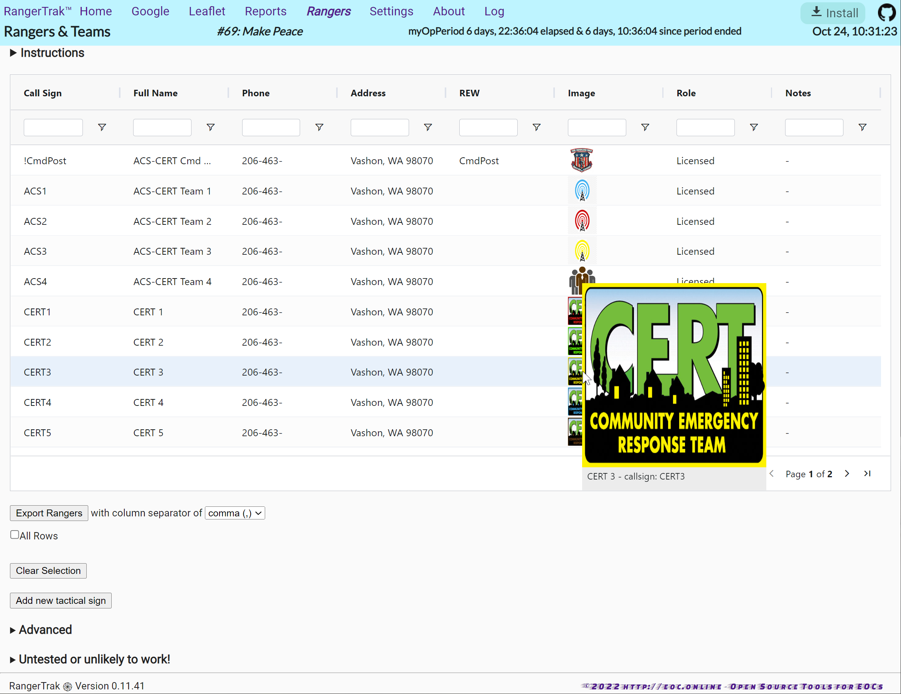
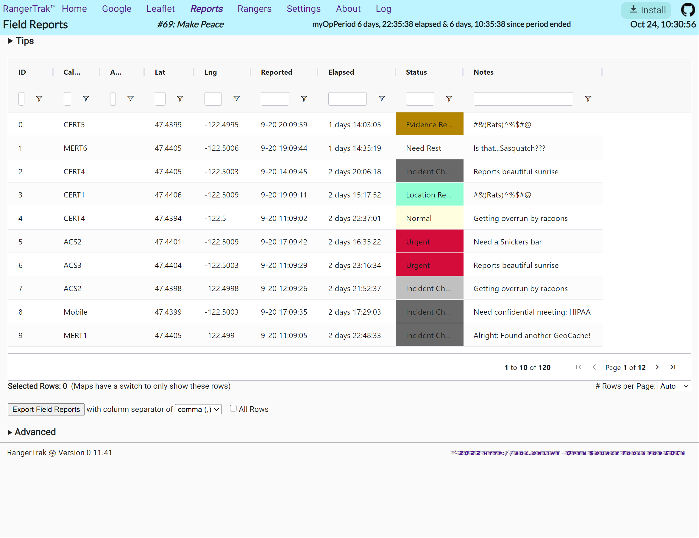
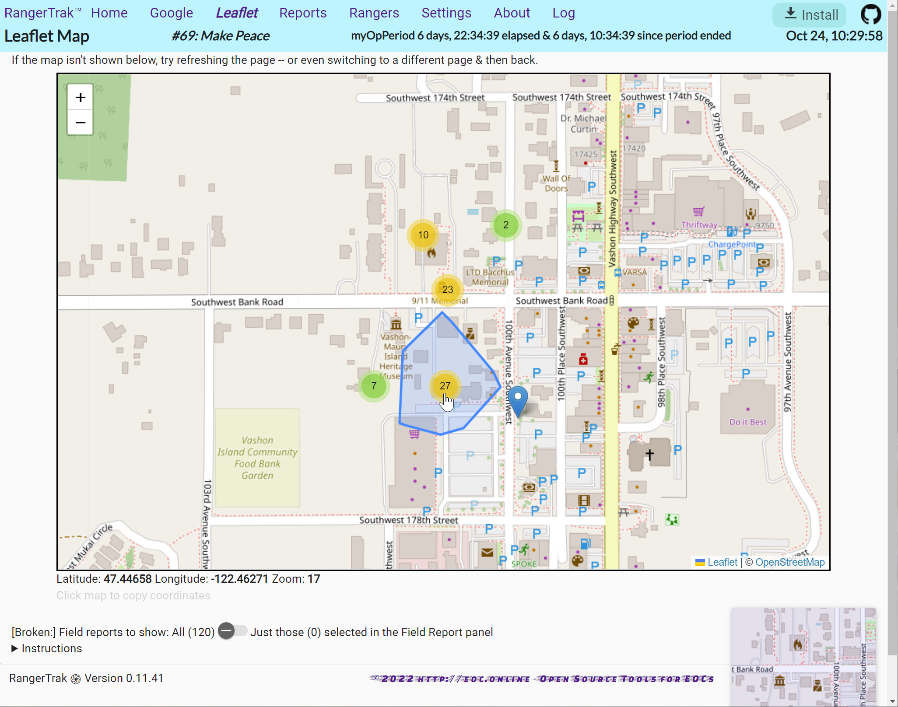
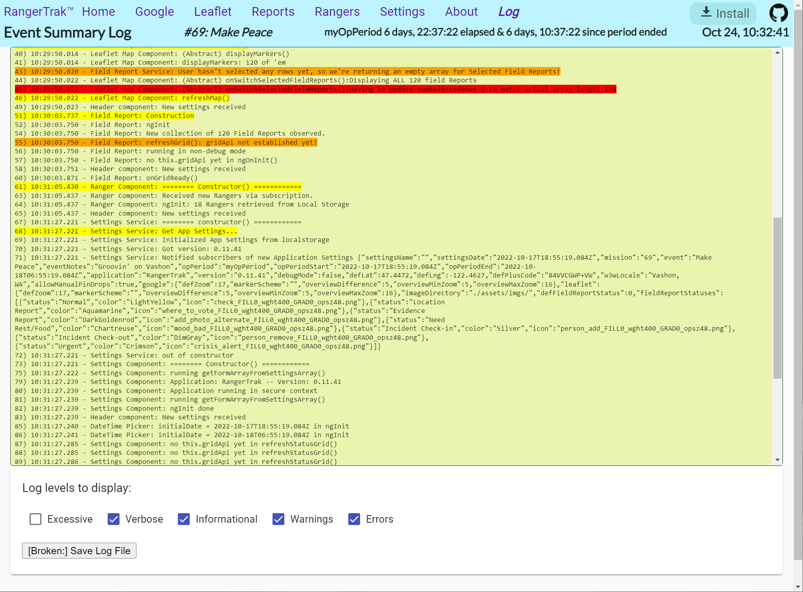

# RangerTrak Field Guide

For the people who actually use RangerTrak during a mission — Emergency Coordinators, net
control operators, and anyone staffing a command post. No technical background assumed.

*Developers: see [ARCHITECTURE.md](ARCHITECTURE.md) instead. This document deliberately
avoids implementation detail.*

---

## What RangerTrak does

RangerTrak records **who is where, when, and in what condition** during a mission, and
plots it on a map. It runs entirely in your browser on your own device. There is no
server, no account, and no login — nothing you type is sent anywhere.

| Page | What it's for |
| --- | --- |
| **Home** | Enter a field report: who called in, where they are, their status, and any notes. This is where you spend the mission. |
| **Reports** | Every report so far, in a sortable, filterable table. Select rows here to focus the maps on just those reports. |
| **Rangers** | Your roster — call signs, names, contact details, teams. |
| **Map (Leaflet)** | Full-page map using standard online road maps. Best detail, anywhere in the world, but needs Internet. |
| **Map (Offline)** | Full-page map using map data built into the app. Works with no Internet at all, but currently only covers Vashon Island in detail. |
| **Settings** | Mission name, operating period, default location, status labels and colours, backup and restore. |
| **Log** | A running record of what the app did, including warnings and crashes. Export it when reporting a problem. |

### Who it's for

RangerTrak is built for teams reachable only by **voice radio** — CERT, ACS/ARES, SAR, and
wildland-fire operations — where field members carry no networked device. Three roles:

1. **Scribe / net control (command post).** Sets up the mission and operating period once,
   maintains the roster, then spends the incident on the Home screen transcribing reports
   radioed in: who, where, when, status, notes. **This is the primary user** — the app is
   designed around their speed and accuracy.
2. **Field ranger / team.** Never touches the app. They are a voice on the radio.
   RangerTrak's job is to make their spoken location fast and unambiguous to write down.
3. **Analyst / Incident Commander.** Uses the Reports table and maps during the incident to
   see coverage and status, and exports afterwards for the after-action record.

### No accounts, no API keys, ever

**No API key is ever required for RangerTrak's core function.** There is nothing to sign
up for, nothing to pay for, and no key to obtain before you can work:

| What you're doing | Needs a key or account? |
| --- | --- |
| Coordinate entry (decimal, DMS, DDM) | No — calculated on your device |
| Plus Codes | No — calculated on your device, works offline |
| Both map displays | No |
| Address lookup | No (but does need Internet) |
| Reports, roster, export and import | No |

Anything that ever *does* need a key will be optional, will say so honestly when it isn't
available, and will never block you from entering and mapping reports.

> If your team adds an optional key-based feature later, sort it out **during mission
> preparation, never during a callout.** Discovering you need to go register for something
> while people are on the radio is exactly the situation this rule exists to prevent.

### Why Plus Codes

Both Plus Codes and What3Words turn a location into something short enough to say over a
radio. The difference is what happens when the Internet doesn't.

A **Plus Code is calculated** — your device derives it from the coordinates itself,
instantly, with no network, no account, and no API key, under an open standard anyone can
implement. A **What3Words address must be looked up** from their servers on every single
conversion.

In a command post with no connectivity — the exact situation RangerTrak was built for —
one of these keeps working and the other doesn't. RangerTrak supports both, but it defaults
to the one that can't be taken away.

---

## The three ways RangerTrak starts

How well RangerTrak works without Internet depends entirely on what you did **before** you
lost it. Three cases, worth knowing by name:

### 🔥 Hot start — fully prepared

You set the app up in advance while connected. Everything is already on the device: the
app itself, your roster, your mission settings, and map coverage for your area.

**Works with no Internet whatsoever.** This is what you want for a real mission.

### 🌤 Warm start — app used before, on this device

You have opened RangerTrak on this device before while connected, but did not do full
preparation. The app itself will load offline, and any map area you previously looked at
will still be there. Areas you never viewed will be blank.

**Mostly works offline**, with gaps you will discover at the worst moment.

### ❄️ Cold start — first time on this device

You are opening RangerTrak on this device for the first time. Without Internet, nothing
loads at all — the app has to be fetched at least once.

**Requires Internet to get going.** See [Cold start](#cold-start-no-preparation-no-internet)
below for what to do if you're caught this way.

---

## Before the mission: getting to a hot start

Do this while you still have Internet and mains power. It takes a few minutes and is the
difference between a working tool and a blank screen.

**1. Install RangerTrak as an app.**
Look for the **Install** button in the top-right of the header. Installing gives you a
proper icon, a window without browser clutter, and makes the device far more likely to
keep your data.

**2. Ask the browser to protect your data.**
Go to **Settings** and check the storage status. If it offers to request persistent
storage, accept. Without this, a browser short on disk space may quietly discard your
mission data. RangerTrak asks automatically, but browsers are more willing to say yes once
the app is installed — so do this *after* step 1.

**3. Load your roster.**
On the **Rangers** page, enter your people or import them, then use **Save Rangers**.
Roster edits are *not* saved automatically — you must press the button.

**4. Set up the mission.**
On the **Settings** page, fill in the mission and event names, the operating period start
and end, and the default coordinates for your area. The default location is where maps and
new reports start from, so getting it right saves work all mission.

**5. Check your statuses.**
Still in **Settings**, review the field report statuses and their colours. These drive the
colour coding on the Reports table. Rename them to match your agency's terminology now,
not mid-mission.

**6. Prime the maps — the step people forget.**

- Open **Map (Offline)** once. The built-in map data is only stored on your device the
  first time you open that page, so visiting it once while connected is what makes it
  available later with no Internet.
- Open **Map (Leaflet)**, navigate to your operating area at the zoom levels you expect to
  use, and press **💾 Save this area for offline use**. This stores those road map tiles
  on the device. Only the areas and zoom levels you actually save will be available later.

**7. Take a backup.**
On **Settings**, press **Export Mission**. This writes a single file containing your
settings, roster, and any reports. Keep it somewhere safe — a USB stick, another device.
If the browser data is ever lost, **Import Mission** restores everything.

> ⚠️ That export file contains personal information about your people — names, home
> addresses, phone numbers, and call signs — and it is **not encrypted**. Treat it like any
> other confidential roster.

**8. Try it for real.**
Turn off Wi-Fi and mobile data, then open RangerTrak and enter a test report. Five minutes
of this now is worth more than any checklist. Delete the test report afterwards.

---

## During the mission

**Entering a report.** On the **Home** page, pick the call sign, set the location, choose a
status, add notes, and submit. Reports save to the device immediately.

**Setting a location.** You can enter coordinates directly, or type an address and let
RangerTrak look it up. You can also click any map to copy the coordinates under your
cursor, then paste them in.

> Address lookup needs Internet. Without it, you'll see a message saying so. Coordinates
> always work offline — so if the network is down, work in coordinates.

**Watching the picture develop.** Both map pages plot every report. Where reports cluster
together, they are grouped into a numbered circle; zoom in to separate them. Click a marker
for detail.

**Focusing on a subset.** Select rows on the **Reports** page, then switch to a map — you
can show just the selected reports instead of everything. Useful for a single team or a
single incident.

**Handing over.** Press **Export Mission** on **Settings** and give the file to the
incoming operator, who imports it on their device.

---

## Screen by screen

*(Click any image for a larger version. These were captured from an earlier release — the
layout has changed in places, but the workflow has not.)*

### Settings — start here

> ⚠️ **Before changing settings**, export anything you need to keep. Setup steps can
> replace existing data.

At the start of every mission and operating period, enter the mission and operating period
details and the default location that new reports start from. Map behaviour and the field
report statuses can be adjusted here too.

### Rangers — who is participating

Second, record the people and teams taking part. Entries can be individuals or team
tactical signs — RangerTrak treats them identically. Editable throughout, and exportable to
a spreadsheet. **Remember to press Save Rangers.**

Once those two screens are done, you will spend nearly all of the rest of the incident on
the Home screen.

### Home — entering field reports

 Screen")

1. **Who** — type any letters of a tactical call sign; the list filters as you type.
2. **Where** — enter a location in any supported format. The derived address and map
   position are shown back to you for confirmation.
3. **When** — defaults to now. Edit it if the report came in earlier.
4. **What** — the status (defaults to "normal"), plus free-text notes. Notes can carry
   incident-specific keywords, which you can search for later on the Reports page.
5. **Submit.** A confirmation appears briefly and the form resets for the next report.
   Mistakes can be corrected later on the Reports page.
6. **Reset** clears the form so you can start over.

### Reports — the full log

Every report in a sortable, filterable, searchable table. Filter or select rows, then map
or export just that subset for documentation and after-action analysis.

### Maps

Both map pages plot the reports entered so far, or just the subset selected on the Reports
page.

### About and Log

**About** explains the application, the technologies behind it, how to report issues, and
the licence.

**Log** records what the app did during the session, colour-coded by severity, including
any errors or crashes. Tick the level checkboxes to control how much detail is shown —
this only changes the display, it never discards entries.

**Reporting a problem.** Press **Save Log File** to download the log as a spreadsheet file
and attach it to your bug report — it is far more useful than a description of what went
wrong. Two things to know:

- **The log is not saved between sessions.** Reloading or closing the app clears it, so
  export *before* reloading if something has gone wrong.
- ⚠️ **The log may contain confidential information.** It is a raw diagnostic record and
  can include field report details, street addresses, and call signs, and the file is not
  encrypted. Share it only with the people who need it to diagnose the problem, and delete
  it afterwards. A future release will add a second, redacted export for anonymized
  analysis and hot-wash replay; until then, treat every log export as sensitive.

---

## Starting over: clearing all data

To reset a device to a clean state — after an exercise, or before handing it to another
group:

> ⚠️ **Export first.** This is irreversible, and there is no undo.

1. **Settings** → *Advanced Options* → **Reset Settings**, then re-enter what you want.
2. **Rangers** → *Advanced* → **Delete Rangers**. Note that a default roster is loaded
   automatically in its place; edit or replace it as needed, then **Save Rangers**.
3. **Reports** → *Advanced* → **Delete ALL Field Reports from local storage**.

Switching to a different browser or a different device also gives you a completely fresh
environment — RangerTrak's data is per-browser, so Firefox knows nothing about what you did
in Chrome. That is a convenient way to experiment without disturbing a real mission.

---

## Cold start: no preparation, no Internet

If RangerTrak has never been opened on this device and you have no connection, it cannot
load. There is no way around this — the app has to arrive from somewhere once.

Your options, best first:

1. **Find any connection, however brief.** A phone hotspot for even a minute is enough to
   load the app. Then immediately follow the setup steps above.
2. **Use a device that already has it.** Any device with a warm or hot start is more
   valuable right now than a faster device without one.
3. **Restore from a backup file.** If someone has an exported mission file, open
   RangerTrak on a device that *can* load it and use **Import Mission**.

Once you are running, **capture data first and tidy later**. Coordinates and call signs
work offline; address lookup does not. A report with coordinates and a call sign is
complete enough — addresses can be filled in afterwards.

---

## What needs Internet, and what doesn't

| Feature | Without Internet |
| --- | --- |
| Entering and saving reports | ✅ Works |
| Roster, Reports table, Settings, Log | ✅ Works |
| Exporting and importing missions | ✅ Works |
| Coordinate entry and conversion | ✅ Works |
| **Map (Offline)** | ✅ Works — *if that page was opened once while connected* |
| **Map (Leaflet)** | ⚠️ Only the areas you saved in advance |
| Address lookup (typing an address to get coordinates) | ❌ Needs Internet |
| Reverse lookup (coordinates to a street address) | ❌ Needs Internet |

---

## Your data, and who can see it

Everything lives **on your device only**, in your browser's storage. Nothing is uploaded.

That cuts both ways:

- **Nobody else can see your mission data** — no server, no account, no third party.
- **Nobody else can recover it either.** Clearing browser data, using a different browser,
  or using a different device means starting empty. **Export regularly.**

The roster is the sensitive part: names, home addresses, personal phone numbers, photos,
and call signs that tie back to publicly searchable licence records. It is stored
unencrypted, and exports are plain files. **The same applies to log exports** — the log is
a raw diagnostic record and can quote report details and addresses verbatim. Share only with people who need it for the
mission, and delete exports when the mission is over. Follow your agency's policy on
handling participant information.

---

## Trying it out, and known rough edges

**Want to see it populated?** On **Settings**, under *Advanced Options*, press
**Load Sample Mission**. This fills the app with a demonstration roster and about thirty
reports across Vashon Island — useful for training, demonstrating to others, or just
seeing what a busy mission looks like.

> This **replaces** your current roster and reports. Export first if you have anything you
> need.

**Rough edges to be aware of:**

- **Roster edits are not saved automatically.** Press **Save Rangers** on the Rangers page,
  or your changes are lost on reload.
- **The offline map covers Vashon Island only.** Outside that area you get a plain
  background with your report markers on it — correct positions, no streets. Broader
  coverage is planned.
- **The Leaflet map does not automatically zoom to fit your reports.** Zoom out to find
  them if they are outside the current view.
- **Report selection resets** when you reload the page or move between pages.

If something looks wrong, check the **Log** page — it records what the app did and any
errors, which is the most useful thing to include when reporting a problem.
