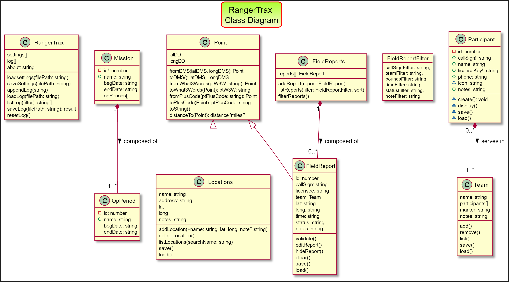

# Rangertrak

This application aids tracking & mapping CERT, ACS, other teams, rangers & individuals roaming around, who are only reliably connected via HAM radio or other non-data supporting means. Teams or individuals can radio in their locations - in a variety of formats, and be centrally tracked. A single log of reports, locations, events and time is created for documentation and analysis. Most critically search area coverage can be determined and teams/individuals that have NOT reported in can be monitored.

This Progressive Web Application (PWA) will largely run even if there is incomsistent, limited, or no cell, internet or data access at the command post.  Rangers can radio in their locations - using a variety of location codes, and be centrally tracked.

Verbally transmitting & transcribing latitude & longitude coordinates can be very error prone and slow. Instead RangerTrak also permits other ways to report locations: by Street Address, Google PlusCodes, and perhaps What3Words. See <https://en.wikipedia.org/wiki/Open_Location_Code#Other_geocode_systems> for a list.

## Features

- Open Source: *free* to use & available to enhance!
- Progressive Web App (PWA) this should be able to function (in the future, possibly with some degredation) even if the person using this at the command post has no or intermittent access to the Internet or cell system.
- Periodic reports can include an editable stsus field and include easily searched notes which can include keywords that make sense locally.
- Tracks mission numbers and names, plus Operational Periods.
- Versions after 0.0.10 are generated with Angular & written in enterprise level Typescript, so will run on most modern web browsers, regardless of device/form factor.
- Supports recording locations as: lat/long (in Decimal Degrees, Degrees Minutes and Seconds, and Degrees and Decimal Minutes), or What3Words, Google +Codes, or physical Street Addresses. Location support may factor in bounding zones or proximity to a locality.
- Lists of reports and rangers can be saved to a CSV (comma seperated value) file for display, documentation and after action analysis - readible by any spreadsheet programs.
- Easy entry via auto-lookup of Ham Radio teams or individuals by tactical callsign.
- Field report statuses can be edited: name & color, future: icon/markers.
- View locations on Google and Leaflet/ESRI maps. (Google has yet to support offline/disconnected mapping, but is working on it for the future.) Maps also have overview/locator maps.
- Rangers can report in as individuals or teams: both are easily edited/sorted/filtered and then only that subset may be exported or displayed on maps.
- Source code documentation uses [https://compodoc.app/guides/jsdoc-tags.html]Compodoc
- Source code is evergreen: current with latest libraries (as of fall 2022)

## Future Roadmap

- To work with out flaws!
- Enhance map markers to better highlight paths, teams, statuses.
- Reload data from local files.
- Allow loading of additional map layers (e.g., an image of trails, local features)
  perhaps with <https://github.com/publiclab/Leaflet.DistortableImage>
- improved docs: screenshots and architectural diagrams.
- consider <https://github.com/EventEmitter2/EventEmitter2> for multi-threaded msgs with service workers.
- Optionally publish field reports to a server if Internet access allows: for display at a central EOC or even by participants out in the field with data or cell coverage.

## Items (still) requiring online access

- GeoCoding an address
- All maps (for now)
- 3Word functionality (for now)

## Screenshots

- So you get an idea of how it looks/works here's a typical workflow:

## To Run

- Simply visit <https://www.RangerTrak.org> and try entering some reports. All data is stored locally in your browser's Local Storage: no tracking codes are used. You will have the option to "Install" the application, which just streamlines access with a shortcut. The applicatino takes minimal space and does not run in the background. You can uninstall it like any other app.

## To Build and Test

- Fork Github.com/eocOnline/Rangertrak to your own repository
- Install NodeJS and NPM
- `cd RangerTrak`
- `npm install`
- `ng serve -o`

- or Run `ng serve` for a dev server. Navigate to `http://localhost:4200/`. The app will automatically reload if you change any of the source files.

For production release:
 `npm run build --release` (???)
 `ng build`

## Running unit tests

- Run `ng test` to execute the unit tests via [Karma](https://karma-runner.github.io).
- None currently!

## Running end-to-end tests

Run `ng e2e` to execute the end-to-end tests via a platform of your choice. To use this command, you need to first add a package that implements end-to-end testing capabilities.

- None currently!

## To update documentation

`npm run compodoc` to regenerate the doc.
`compodoc -s` to serve/view the doc at `http://127.0.0.1:8080/`
See <https://compodoc.app/guides/usage.html> and <https://compodoc.app/> for details

## To update Version

stage any changes (or add '--allow-empty' to the following), then
`git commit -m "Release-As: 0.11.40"`
which *SHOULD* (but doesn't) update version # in Package.json & Package-lock.json
Some details in service/settings.service.ts & app.component.ts
<https://github.com/googleapis/release-please#how-do-i-change-the-version-number>

## To Deploy to Google Firebase

This got WAY to complex with Google's recent security upgrades. Now I just FTP it to https://RangerTrak.org

OLD:
`ng deploy`
`ng add @angular/fire`
From Angular Projects, 2nd ed. pg 119
See angular.json and firebase.json

## Architecture

## Further help

To get more help on the Angular CLI use `ng help` or go check out the [Angular CLI Overview and Command Reference](https://angular.io/cli) page.

## eoc.online

<http://eoc.online> provides free tools for Emergency Operations Centers and local CERT/VOAD/Citizen Corps groups. For more information check out <http://eoc.online> & to report issues please visit <https://github.com/EOCOnline/rangertrak>.

©2022 eoc.online, under the MIT License

