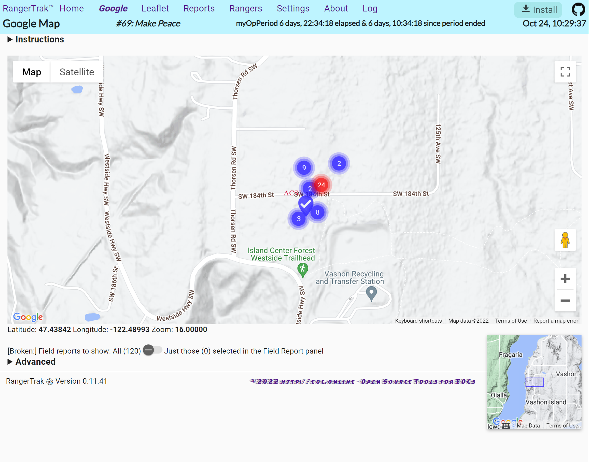
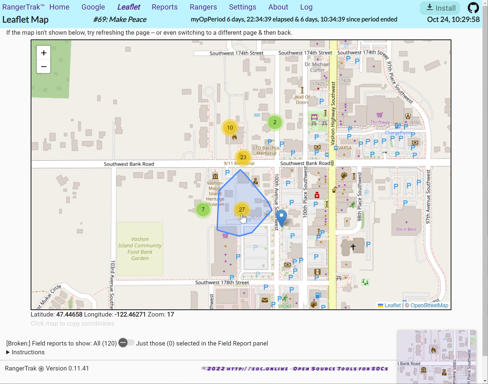
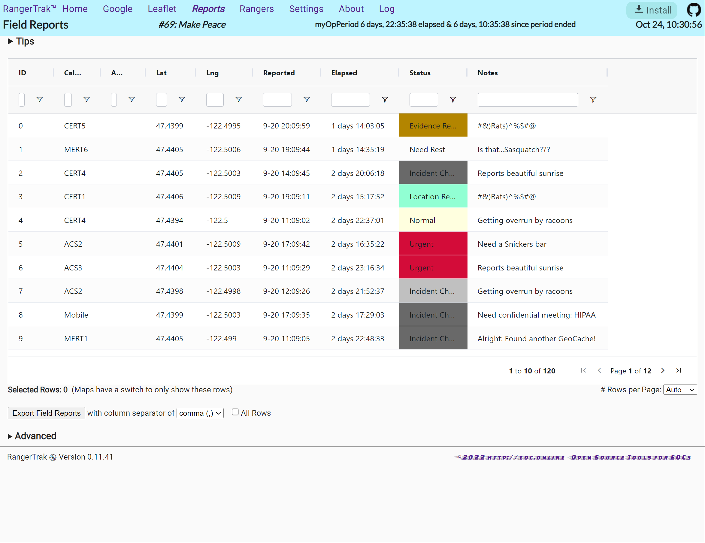
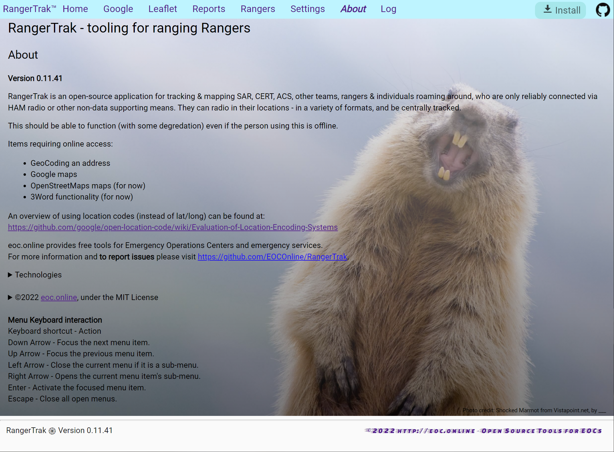
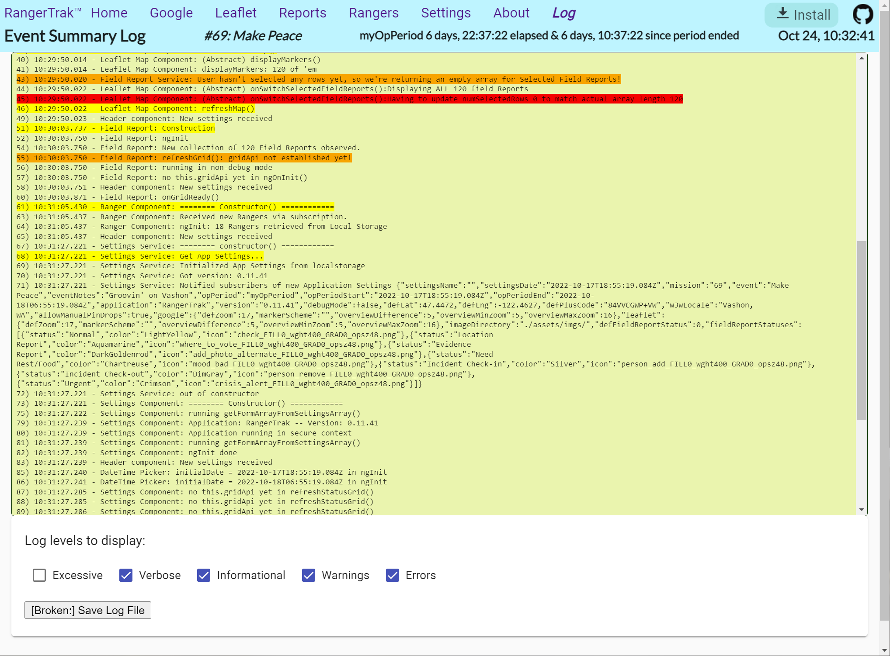

# Rangertrak™

The RangerTrak™ application aids tracking & mapping CERT, ACS, other teams, rangers & individuals roaming around, who are only reliably connected via HAM radio or other non-data supporting means. Teams or individuals can radio in their locations - in a variety of formats, and be centrally tracked. A single log of reports, locations, events and time is created for documentation and analysis. Most critically search area coverage can be determined and teams/individuals that have NOT reported in can be monitored.

This Progressive Web Application (PWA) will largely run even if there is inconsistent, limited, or no cell, internet or data access at the command post.  Rangers can radio in their locations - using a variety of location codes, and be centrally tracked.

Verbally transmitting & transcribing latitude & longitude coordinates can be very error prone and slow. Instead RangerTrak also permits other ways to report locations: by Street Address, Google PlusCodes, and perhaps What3Words. See <https://en.wikipedia.org/wiki/Open_Location_Code#Other_geocode_systems> for a list.

## For Users

To use and see what this application does, simply browse to <https://Rangertrak.org>. Additinoal guidence follows,

### Features

- Open Source: *free* to use & available to enhance!
- Progressive Web App (PWA) this should be able to function (in the future, possibly with some degredation) even if the person using this at the command post has no or intermittent access to the Internet or cell system.
- Periodic reports can include an editable status field and include easily searched notes which can include mission specific, custom keywords.
- Tracks mission numbers and names, plus Operational Periods.
- Versions after 0.0.10 are generated with Angular & written in enterprise level Typescript, so will run on most modern web browsers, regardless of device/form factor.
- Supports recording locations as: lat/long (in Decimal Degrees, Degrees Minutes and Seconds, and Degrees and Decimal Minutes), or What3Words, Google +Codes, or physical Street Addresses. Location support may factor in bounding zones or proximity to a locality.
- Lists of reports and rangers can be saved to a CSV (comma seperated value) file for display, documentation and after action analysis - readible by any spreadsheet programs.
- Easy entry via auto-lookup of Ham Radio teams or individuals by tactical callsign.
- Field report statuses can be edited: name & color, future: icon/markers.
- View locations on Google and Leaflet/ESRI maps. (Google has yet to support offline/disconnected mapping, but is working on it for the future.) Maps also have overview/locator maps.
- Rangers can report in as individuals or teams: both are easily edited/sorted/filtered and then only that subset may be exported or displayed on maps.
- Source code documentation uses [https://compodoc.app/guides/jsdoc-tags.html]Compodoc
- Source code is evergreen: current with latest libraries (as of fall 2022)

### Future Roadmap

- To work with out flaws! In particulr one often has to refresh some pages to get them to display - especially the Leaflet Maps page - or screen.
- Issues should be moving from a spreadsheet to [the standard GitHub Issues Page](https://github.com/EOCOnline/rangertrak/issues)
- Enhance map markers to better highlight paths, teams, statuses.
- Reload data from local files.
- Allow loading of additional map layers (e.g., an image of trails, local features)
  perhaps with <https://github.com/publiclab/Leaflet.DistortableImage>
- improved docs: screenshots and architectural diagrams.
- consider <https://github.com/EventEmitter2/EventEmitter2> for multi-threaded msgs with service workers.
- consider adding heatmaps, or <https://github.com/eurostat/gridviz>
- Optionally publish field reports to a server if Internet access allows: for display at a central EOC or even by participants out in the field with data or cell coverage.

### Items (still) requiring online access

- GeoCoding an address
- All maps (for now)
- 3Word functionality (for now)

### Screenshots & Typical Workflow

So you get an idea of how it looks/works here's a typical workflow. (Click images for larger versions.)

#### Mission Settings Screen: Start here!

At the start of every mission and Op Period, come to this screen and enter mission and operational period parameters and the default location to simplify location entry for each field report. Some mapping parameters can also be adjusted. Field Report statuses can be edited as desired. The background incidentally shows RangerTrak being tested in a real-world exercise.

**WARNING: Before doing the above** Be sure you have backed up and downloaded any previous mission data, via the Export Buttons on the [Field Reports Page](https://www.RangerTrak.org/reports) and [Rangers Page](https://www.RangerTrak.org/rangers) Screens.

#### Rangers Screen

**Secondly,** at the start of an Operational Period, come to this screen to enter/edit/record rangers participating. Afterwards this displays Rangers participating in the exercise. This can refer to individuals and/or teams as desired. Rangers can be edited as needed, and optionally exported to a CSV spreadsheet.

Once those initial two steps are complete (i.e., the two screens above), **users will just primarily use the Entry Screen, below, for most of the rest of the exercise or incident.**

#### Home (Entry) Screen

Most users will spend most of their time entering field reports from this 'home' or entry screen. It allows a 'scribe' to record 'Field Reporrts', i.e., ranger's locations and status reports.

1. Start by enter any letters of a tactical call sign in the Who field. The app filters rangers with those letters for ready selection.
2. Next, enter a location in any of the labeled formats. Derived addresses will then be displayed and mapped for your confirmation.
3. When defaults to the current time. Edit it if the report was previoulsy recieved.
4. What records the report status or nature, defaulting to "normal". You can enter freeform notes as desired too, possibly entering custom, unique incident specific keywords. Those can be filtered/searched for on the Field Reports Screen if desired.
5. Submit your report. (Mistakes can generally be edited in the Field Reports Screen.)
6. The Reset button clears the form of any data erroneously entered and lets the scribe start over with a clean field report.

 Screen")

#### Google Maps Screen

This displays Field Reports that have been entered, and optionally a filtered subset of reports.

#### Leaflet Maps Screen

This displays Field Reports that have been entered, and optionally a filtered subset of reports.

#### Field Reports Screen

The next screen displays Field Reports that have been entered, in a table or grid format, with the ability to filter, sort, and search reports on any field. Filtered reports can be mapped or exported to a CSV spreadsheet for documentation or later analysis.

#### About Screen

This provides a bit more explaination about the application, its purpose, technologies used, how to report issues, and license model.

#### Logs Screen

This screen is primarily used for debugging and reporting issues. It can also serve as a partial audit trail of actions taken during the mission.

### To Run

Simply visit <https://www.RangerTrak.org> and follow the Workflow above: enter Mission info on the Settings page, then enter Rangers, then repeatedly enter reports. All data is stored locally in your browser's Local Storage: no tracking codes are used.

Moving to a different browser, or device will provide a 'fresh' RangerTrak environment. RangerTrak’s machinations are all local to each brand of browser (Firefox won’t know what you did with Chrome or Edge), so that gives you a way to experiment.

### To Reset/Clear all Data

1. Browse to <https://www.RangerTrak.org>
2. Go to [Settings Page](https://www.RangerTrak.org/settings) and under Advanced at the very bottom, click on “Reset Settings”, then edit the fields as desired.
3. Go to the [Rangers Page](https://www.RangerTrak.org/rangers), then under Advanced at the bottom, click on “Delete Rangers” which should load the default ranger teams. (This will change in the future. Its convenient for testing though. You can rename Teams by clicking on the name. For ANY changes: under Advanced, remember to click “Save Rangers” to preserve changes!
4. Go to the [Field Reports Page](https://www.RangerTrak.org/reports), then under Advanced at the bottom , click on “Delete ALL Field Reports from local storage” – if there are any! (You may enter new reports or use the mint colored block below to “Add some ## of Fake Reports” which auto generates some reports to experiment with.)

### Installation

At the upper right of every screen, or additinoally on the [Settings Page](https://www.RangerTrak.org/settings), You will have the option to "Install" the application, which just streamlines access with a shortcut. The application takes minimal space and doesn't consume resources in the background. You can uninstall it like any other app.

## For Developers Interested in Modifying or Contributing to the Project

### To Build and Test

- Fork Github.com/eocOnline/Rangertrak to your own repository
- Install NodeJS and NPM
- `cd RangerTrak`
- `npm install`
- `ng serve -o`

- or Run `ng serve` for a dev server. Navigate to <http://localhost:4200/>. The app will automatically reload if you change any of the source files.

For production release:
 `npm run build --release` (???)
 `ng build`

### Running unit tests

- Run `ng test` to execute the unit tests via [Karma](https://karma-runner.github.io).
- None currently!

### Running end-to-end tests

Run `ng e2e` to execute the end-to-end tests via a platform of your choice. To use this command, you need to first add a package that implements end-to-end testing capabilities.

- None currently!

### To update documentation

`npm run compodoc` to regenerate the doc.
`compodoc -s` to serve/view the doc at <http://127.0.0.1:8080/>
See <https://compodoc.app/guides/usage.html> and <https://compodoc.app/> for details

### To update Version

Stage any changes (or add '--allow-empty' to the following), then
`git commit -m "Release-As: 0.11.40"`
which *SHOULD* (but doesn't) update version ## in Package.json & Package-lock.json
Some details in service/settings.service.ts & app.component.ts
<https://github.com/googleapis/release-please#how-do-i-change-the-version-number>

### To update 3rd party libraries

Commands from Evergreen Angular:

- `npx ng update @angular/core @angular/cli`
- `npx ng update`
- `npx npm-check-updates -u`
- `npm install`

Other useful commands:

- `npm install -g typings` - Looks for updated Typescript type files.
- `npx ng update -g`  - Updates global cli & sdk

### To Deploy

Deploying via Google Firebase got WAY to complex with Google's recent security upgrades.

Now I just FTP it to <https://RangerTrak.org>

OLD:
`ng deploy`
`ng add @angular/fire`
From Angular Projects, 2nd ed. pg 119
See angular.json and firebase.json

### Architecture

Way out of date!

### Further help

To get more help on the Angular CLI use `ng help` or go check out the [Angular CLI Overview and Command Reference](https://angular.io/cli) page.

## eoc.online

<http://eoc.online> provides free tools for Emergency Operations Centers and local CERT/VOAD/Citizen Corps groups. For more information check out <http://eoc.online>. We'd LOVE to get your reports of use and suggestions for enhancement. To report issues please visit <https://github.com/EOCOnline/rangertrak/issues>.

©2022 eoc.online, under the MIT License

### Testimonials

---
> "*(We) all agreed that this is a WOW program with high value added to SAR.  I really hope you continue to refine it!*"

— Michael Meyer, KB7MTM, [Vashon ACS](https://vashonbeprepared.org/en-us/Partners/ACS)
